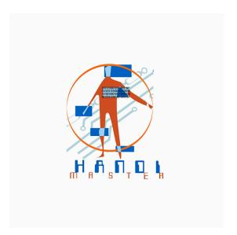

# Master 2 MIASHS - Parcours Technologie & Handicap

Université Paris 8, Vincennes - Saint-Denis

# CarryBot

Robot compagnon d'assistance pour transport d'objets légers en intérieur

Version 3.0

Rédigé par :

Lena BESSA Zhaoyu WANG Xinqi TANG Lou LOPEZ

Enseignants :

Dominique ARCHAMBAULT Salvatore ANZALONE

Année universitaire : 2025-2026

# Table des matières

| Table des figures                                                | 2  |
|------------------------------------------------------------------|----|
| Récapitulatif des versions                                       | 2  |
| Documents de référence & sitographie                             | 3  |
| Glossaire                                                        | 4  |
| 1 Présentation du projet                                      | 5  |
| 1.1 Éléments généraux du projet                               | 5  |
| 1.1.1 Contexte                                                | 5  |
| 1.1.2 Objectif général                                        | 5  |
| 1.1.3 Finalités du projet                                     | 5  |
| 1.1.4 Population concernée                                    | 5  |
| 1.2 Organisation du projet                                    | 6  |
| 1.2.1 Éléments de macro-planning                              | 6  |
| 1.2.2 Répartition des rôles au sein de l'équipe               | 6  |
| 1.2.3 Matrice RACI                                            | 7  |
| 1.3 Domaine couvert et périmètre du projet                    | 7  |
| 1.3.1 Domaine couvert                                         | 7  |
| 1.3.2 Périmètre du projet                                     | 8  |
| 1.3.3 Hors périmètre                                          | 8  |
| 1.4 Synthèse de l'analyse de l'existant                       | 8  |
| 2 Description du système ou produit                           | 12 |
| 2.1 Synthèse                                                  | 12 |
| 2.2 Architecture                                              | 12 |
| 2.3 Matériel                                                  | 13 |
| 2.4 Logiciel                                                  | 14 |
| 2.5 Acteurs                                                   | 14 |
| 2.6 Analyse des besoins                                       | 15 |
| 2.7 Formulaire d'analyse des besoins — Tableau professionnel  | 16 |
| 2.7.1 Personas — Public cible                                 | 16 |
| 2.7.2 Exigences fonctionnelles                                | 18 |
| 2.7.3 Exigences qualité (non fonctionnelles)                  | 18 |
| 2.7.4 Exigences légales et réglementaires                     | 19 |
| 3 Solutions et orientations                                   | 19 |
| 3.1 Solutions techniques retenues                             | 19 |
| 3.2 Contraintes et orientations de conception                 | 19 |
| 3.3 Plan de réalisation                                       | 20 |
| 3.4 Perspectives                                              | 20 |
| 4 Validation et tests utilisateurs                            | 20 |
| 4.1 Critères de validation — Tests techniques et fonctionnels | 20 |
| 4.2 Scénario UX 1 — Personne à Mobilité Réduite (PMR)         | 21 |
| 4.3 Scénario UX 2 — Aidante professionnelle (infirmière)      | 23 |

# Table des figures

| 1  | Diagramme de Gantt du projet CarryBot           | 6  |
|----|-------------------------------------------------|----|
| 2  | Robot rosa                                      | 9  |
| 3  | Robot Labrador Retriever                        | 10 |
| 4  | Robot Borobo                                    | 11 |
| 5  | CarryBot en vue globale                         | 12 |
| 6  | Détail de la motorisation et des roues Tri-Star | 12 |
| 7  | La montée de la palette motorisée               | 13 |
| 8  | La descente de la palette motorisée             | 13 |
| 9  | Série d'images de l'architecture de CarryBot    | 13 |
| 10 | Prototype Figma                                 | 14 |
| 11 | interface application Android                   | 14 |
| 12 | Interface principale de l'application CarryBot  | 14 |
| 13 | Persona 1 : Marie, 75 ans, retraitée            | 17 |
| 14 | Persona 2 : Lucas, 30 ans, à mobilité réduite   | 17 |
| 15 | Persona 3 : Claire, 45 ans, aide-soignante      | 18 |

# Récapitulatif des versions

| Version | Date       | Nature de la modification                                                                                                                         | Auteur                         |
|---------|------------|---------------------------------------------------------------------------------------------------------------------------------------------------|--------------------------------|
| 0.1     | 19/11/2025 | Première diffusion document                                                                                                                       | L'équipe                       |
| 1.2     | 20/11/2025 | Rédaction de la partie présentation du projet                                                                                                  | Lena                           |
| 2.0     | 21/11/2025 | Description du système + solutions et orientations                                                                                             | Lena                           |
| 3.0     | 26/11/2025 | Prototype Figma + Application An droid, Analyse des besoins + Personas + diag de Gantt,Ëtat de l'art, Archi tecture CarryBot | Xinqi, Lena, Lou, Zhaoyu |
| 4.0     | 05/12/2025 | Élaboration de la matrice RACI et pro tocole de tests utilisateurs, question naire, validation                                  | Lena, Lou                      |

CarryBot - Master 2 MIASHS, parcours HANDI 2

———

# Documents de référence & Sitographie

| Réf. | Titre                                                      | Auteur / Organisa tion                              | Version / Date |
|------|------------------------------------------------------------|--------------------------------------------------------|----------------|
| [01] | ROSA – Robotic Stair-Climbing Assistant                 | Quantum Robotic Systems Inc. / Hospi tal News | 2020           |
| [02] | Labrador Retriever – Assistive Domestic Robot  | Labrador Systems INC.                            | 2022           |
| [03] | Help-E – Robot suiveur pour charges lourdes | Borobo                                                 | 2022           |

# Glossaire

| Terme                | Description                                                                                                                                                                                     |
|----------------------|-------------------------------------------------------------------------------------------------------------------------------------------------------------------------------------------------|
| Tri-Star             | Mécanisme composé de trois roues montées sur un même moyeu rotatif, permettant le franchissement de petites marches ou obstacles.               |
| IMU                  | (Inertial Measurement Unit) Capteur regroupant accéléro mètre, gyroscope et parfois magnétomètre, servant à mesurer l'inclinaison, l'accélération et la rotation du robot. |
| Raspberry Pi 5       | Micro-ordinateur monocarte utilisé comme unité centrale em barquée pour la gestion des capteurs, moteurs et communica tions du robot.                                                     |
| Intel RealSense D435 | Caméra de profondeur permettant de capturer une carte 3D de l'environnement, utilisée pour la perception et la détection avancée.                                                         |
| Vérin linéaire       | Actionneur électrique convertissant une rotation en mouve ment linéaire, utilisé ici pour stabiliser la palette et ajuster son inclinaison.                                               |
| SLAM                 | Acronyme de "Simultaneous Localization And Mapping", mé thode avancée de navigation exclue du périmètre de ce proto type.                                                                 |
| LIDAR                | Capteur de télémétrie laser utilisé pour la cartographie de l'environnement, proposé en perspective future.                                                                                  |
| PMR                  | Personne à Mobilité Réduite                                                                                                                                                                     |
| RGAA                 | Référentiel Général d'Accessibilité pour les Administrations, norme française d'accessibilité numérique applicable à l'appli cation mobile.                                               |

# 1 Présentation du projet

### 1.1 Éléments généraux du projet

#### 1.1.1 Contexte

CarryBot s'inscrit dans un projet académique visant à explorer la robotique mobile d'assistance au sein d'environnements intérieurs contrôlés. Dans le cadre d'un enseignement universitaire, le robot constitue un support de travail permettant d'aborder la mécatronique, les technologies embarquées et les problématiques d'accessibilité. Le projet s'appuie sur une démarche de conception centrée utilisateur afin d'illustrer comment une solution robotique peut répondre à des besoins concrets d'aide au transport d'objets.

### 1.1.2 Objectif général

L'objectif principal est de développer un prototype fonctionnel de robot collaboratif capable de transporter des objets légers de manière sécurisée et accessible. Ce prototype doit démontrer la faisabilité d'un système simple, robuste et compréhensible, utilisable à des fins domestique et médico.

#### 1.1.3 Finalités du projet

Les finalités du projet CarryBot s'inscrivent dans une démarche d'assistance aux publics fragiles en environnement intérieur. Elles se déclinent comme suit :

- Soutien aux personnes à mobilité réduite : faciliter le transport d'objets du quotidien pour des utilisateurs présentant un handicap moteur ou une autonomie limitée.
- Allègement de la charge physique des aidants : réduire les déplacements répétitifs du personnel soignant ou des aidants dans des environnements tels que les hôpitaux, centres de rééducation ou EHPAD.
- Assistance aux personnes âgées : proposer un dispositif aidant au transport d'objets dans un espace sécurisé, limitant les risques liés aux efforts ou aux déplacements non adaptés.
- Amélioration de l'autonomie en intérieur : offrir un robot capable de fonctionner dans des espaces maîtrisés (chambre, couloir, domicile adapté) afin de soutenir un maintien de l'autonomie au quotidien.
- Accessibilité et simplicité d'usage : fournir une interface de pilotage intuitive, basée sur des pictogrammes, utilisable par des personnes présentant des limitations motrices ou cognitives.

#### 1.1.4 Population concernée

CarryBot s'adresse prioritairement à des publics nécessitant une assistance au transport d'objets dans un environnement intérieur. Les principales populations concernées sont :

- des personnes en situation de handicap moteur
- des personnes âgées
- des patients
- des aidants et personnels soignants
- des structures médico-sociales EHPAD, foyers de vie, services de rééducation.

### 1.2 Organisation du projet

### 1.2.1 Éléments de macro-planning

Le déroulement du projet suit les jalons suivants :

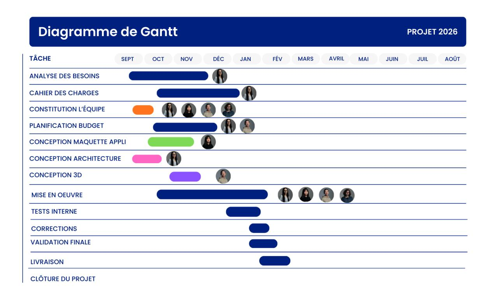

Figure 1 – Diagramme de Gantt du projet CarryBot

#### 1.2.2 Répartition des rôles au sein de l'équipe

| Membre      | Responsabilités principales                                     |  |
|-------------|-----------------------------------------------------------------|--|
| Lena Bessa  | Rédaction du cahier des charges (format LaTeX), analyse des     |  |
|             | besoins, élaboration des scénarios d'usage, contribution à la   |  |
|             | conception fonctionnelle et ergonomique.                        |  |
| Zhaoyu Wang | Modélisation 3D du système Tri-Star, sélection et analyse des   |  |
|             | solutions matérielles (Raspberry Pi, capteurs), participation   |  |
|             | à la conception technique.                                      |  |
| Xinqi Tang  | Développement de l'application Android, intégration des fonc    |  |
|             | tionnalités d'accessibilité, contribution à l'architecture logi |  |
|             | cielle.                                                         |  |
| Lou Lopez   | Réalisation de l'état de l'art, recherche documentaire, veille  |  |
|             | technologique et participation à la conception globale du pro   |  |
|             | jet.                                                            |  |

### 1.2.3 Matrice RACI

Légende :

R — Responsible : réalise l'action

A — Accountable : valide la tâche, responsable final

C — Consulted : consulté pour expertise

I — Informed : tenu informé (non utilisé ici car équipe restreinte)

| Tâches du projet                                  | Lena | Zhaoyu | Xinqi | Lou |
|---------------------------------------------------|------|--------|-------|-----|
| Analyse des besoins                               | R    | C      | C     | A   |
| Cahier des charges                                | R    | C      | C     | A   |
| État de l'art                                     | C    | C      | C     | R   |
| Conception mécanique (Tri Star, châssis)       | C    | R      | C     | A   |
| Conception électronique (capteurs, moteurs) | C    | R      | C     | C   |
| Développement application Android           | C    | C      | R     | A   |
| Architecture logicielle                           | C    | R      | A     | C   |
| Conception interface et er gonomie             | R    | C      | C     | C   |
| Rédaction du rapport                              | R    | C      | C     | C   |
| Tests et validation                               | R    | C      | C     | C   |
| Communication / docu mentation           | C    | A      | A     | R   |

Table 1 – Matrice RACI du projet CarryBot

### 1.3 Domaine couvert et périmètre du projet

#### 1.3.1 Domaine couvert

Le projet CarryBot couvre les domaines suivants :

- robotique mobile légère en environnement intérieur ;
- interaction homme–robot accessible, via une interface mobile simplifiée ;
- technologies embarquées basées sur Raspberry Pi et capteurs associés ;
- aide au transport d'objets pour un usage domestique ou pédagogique ;
- conception d'un prototype fonctionnel intégrant mécanique, électronique et logiciel.

### 1.3.2 Périmètre du projet

Le périmètre retenu inclut :

- la mise en place d'un robot capable de se déplacer en intérieur ;
- l'intégration d'une palette motorisée pour transporter de petits objets ;
- la détection d'obstacles à courte distance ;
- l'intégration d'un bouton d'arrêt d'urgence ;
- le développement d'une application mobile pour le pilotage manuel ;
- l'assemblage d'une architecture complète : mécanique, électronique et supervision logicielle.

### 1.3.3 Hors périmètre

Les fonctionnalités suivantes sont exclues de ce prototype :

- navigation autonome avancée (SLAM, cartographie, planification complexe) ;
- déplacements extérieurs ou sur terrains non stabilisés ;
- transport de charges lourdes ou applications industrielles ;
- intégration de systèmes de communication en réseau étendue (IoT, cloud).

### 1.4 Synthèse de l'analyse de l'existant

L'analyse de l'existant repose sur trois dispositifs représentatifs des solutions d'assistance au transport actuellement disponibles. Ces technologies offrent un aperçu des approches existantes, de leurs domaines d'usage prioritaires et des limites auxquelles CarryBot souhaite répondre.

### ROSA — Robotic Stair-Climbing Assistant

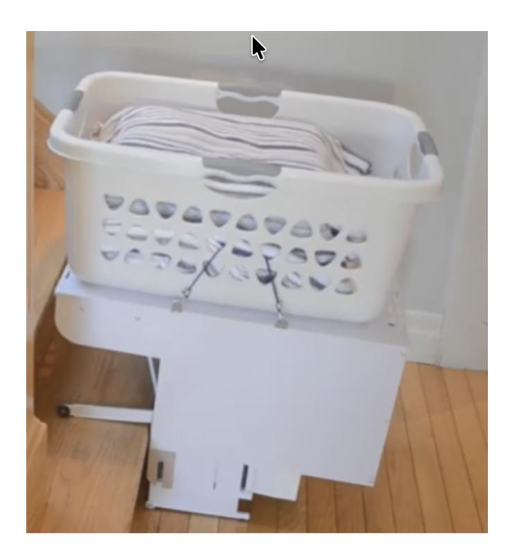

Figure 2 – Robot rosa [Hospital News](https://hospitalnews.com/how-rosa-the-robot-will-help-isolated-seniors-and-support-aging-in-place/); [RobotShop](https://www.robotshop.com/products/quantum-robotic-systems-quantum-robotic-systems-rosa-robotic-stairclimbing-assistant-beta)

ROSA est un robot dédié au transport de charges dans les escaliers. Sa conception repose sur un mécanisme de grimpe permettant de monter ou descendre des marches avec des charges d'environ 25 kg, transportées dans une bassine intégrée. Il vise principalement des usages simples comme le transport de linge ou de déchets entre étages dans un domicile.

### Ce robot se distingue par :

- une mécanique robuste destinée au franchissement vertical ;
- une utilisation simple, centrée sur un bouton de mise en marche et une trajectoire rectiligne ;
- une puissance suffisante pour soulever des charges modérées.

#### Ses limitations portent notamment sur :

- des mouvements très saccadés à chaque marche, rendant le transport d'objets fragiles impossible ;
- l'absence de navigation horizontale ou de déplacement dans le reste du domicile ;
- une fonction unique, exclusivement orientée vers l'escalier.

### Labrador Retriever — Labrador Systems (2022)

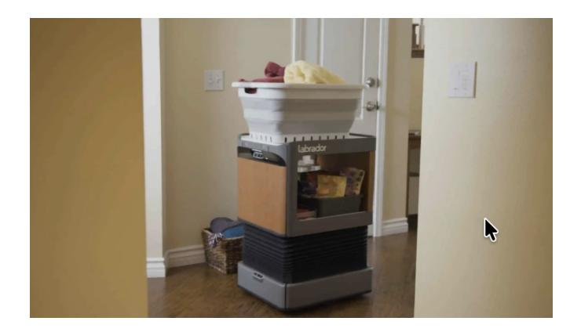

Figure 3 – Robot Labrador Retriever [Labrador Systems](https://labradorsystems.com/); [YouTube](https://www.youtube.com/watch?v=aTOyXBr9VyU)

Le Labrador Retriever est un robot d'assistance domestique polyvalent conçu pour améliorer l'autonomie des personnes à mobilité réduite. Il se déplace automatiquement dans un logement, scanne son environnement et transporte des charges jusqu'à 11 kg. Il peut prendre des plateaux repas, transporter des objets du quotidien, et être commandé vocalement via Alexa.

#### Ses points clés incluent :

- un système de navigation autonome
- des plateaux motorisés réglables en hauteur
- une intégration poussée avec les assistants vocaux,
- une polyvalence domestique

#### Ses limites principales :

- un coût élevé
- l'impossibilité de franchir des escaliers,
- une taille relativement importante, limitant l'usage dans deespaces étroits.

### Help-E — Borobo (2022)

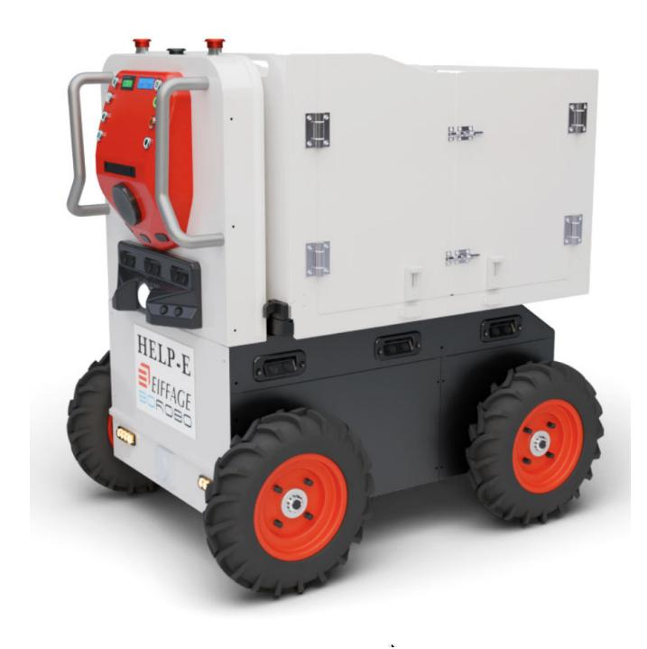

Figure 4 – Robot Borobo [Borobo](https://borobo.fr/) ; [YouTube](https://www.youtube.com/watch?v=frxuhVagJFA)

Help-E est un robot suiveur destiné au transport de charges lourdes (jusqu'à 100 kg). Initialement conçu pour les chantiers ou les hôpitaux, il utilise une reconnaissance visuelle pour suivre automatiquement l'utilisateur. Sa structure robuste et sa grande capacité de charge en font un outil destiné à des environnements professionnels.

#### Caractéristiques marquantes :

- une forte capacité de charge, jusqu'à 100 kg ;
- un suivi autonome de l'utilisateur via vision embarquée ;
- une excellente stabilité sur sol plat ou dans des espaces ouverts.

### Ses limites sont :

- une faible adaptation aux environnements encombrés, comme les domiciles ;
- l'absence de franchissement d'escaliers ;
- une conception pensée pour des structures professionnelles, moins pertinente pour l'assistance individuelle.

#### Synthèse

L'analyse des trois solutions montre que chacune couvre un besoin spécifique :

- ROSA : transport vertical uniquement, sans précision ni transport horizontal ;
- Labrador Retriever : assistance domestique polyvalente, sans capacité en escalier ;
- Help-E : transport lourd en milieu professionnel, mais peu adapté aux espaces restreints.

CarryBot se positionne dans un segment encore peu exploré : un robot domestique capable à la fois de se déplacer dans un environnement intérieur de manière précise, de transporter des charges légères et de franchir des escaliers en minimisant les mouvements brusques, grâce à un système stabilisé et rééquilibré.

# 2 Description du système ou produit

### 2.1 Synthèse

CarryBot est un robot collaboratif miniature destiné à l'assistance au transport d'objets sur de courtes distances en environnement intérieur. Il repose sur une architecture matérielle et logicielle intégrée permettant un déplacement semi-autonome, un pilotage manuel, ainsi qu'une capacité mécanique à franchir de petites irrégularités du terrain.

Le dispositif vise à fournir une aide opérationnelle simple, fiable et adaptée, notamment aux utilisateurs présentant une mobilité réduite ou nécessitant une assistance ponctuelle.

### 2.2 Architecture

L'architecture de CarryBot repose sur une intégration cohérente entre l'électronique embarquée, la motorisation, les systèmes de détection et la couche logicielle de supervision. Elle se structure comme suit :

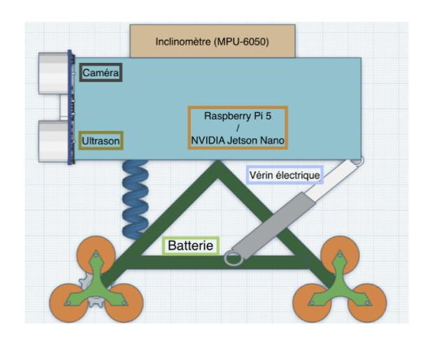

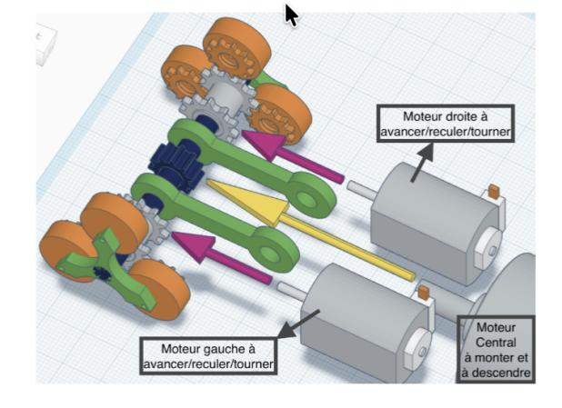

Figure 5 – CarryBot en vue globale

Figure 6 – Détail de la motorisation et des roues Tri-Star

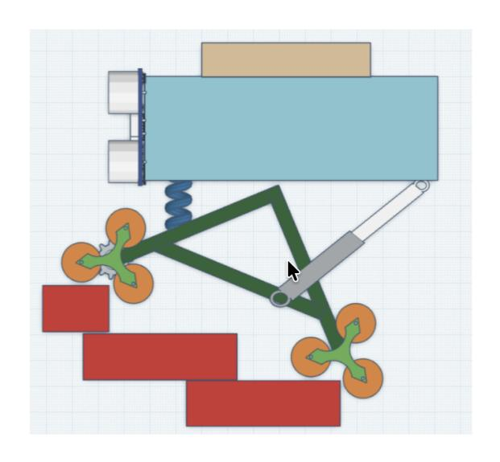

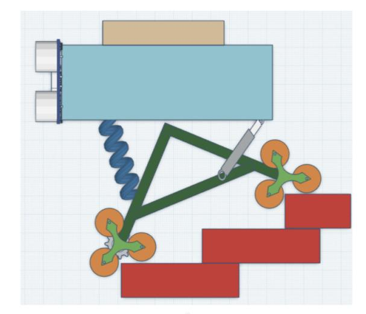

Figure 7 – La montée de la palette motorisée

Figure 8 – La descente de la palette motorisée

Figure 9 – Série d'images de l'architecture de CarryBot

### 2.3 Matériel

- Carte principale : Raspberry Pi 5 (8 GB), équipée d'une carte microSD 32 GB, d'un refroidisseur Active Cooler et d'un câble d'extension GPIO 40 broches.
- Caméra de perception : Intel RealSense D435 pour la capture de profondeur et la détection avancée de l'environnement.
- Capteurs ultrason : 4 modules pour la détection d'obstacles à courte distance.
- Unité inertielle (IMU) : module inclinomètre / accéléromètre / gyroscope (Makeblock) pour la mesure de l'inclinaison et la stabilisation.
- Roues Tri-Star : 20 roues (14 à l'avant, 6 à l'arrière), imprimées en 3D, adaptées au franchissement de petites marches et irrégularités.
- Motorisation : 3 moteurs à courant continu (185 RPM, 9 V) assurant propulsion et direction.
- Actionneur : vérin linéaire électrique 12 V, piloté via un module L293N pour l'élévation et la stabilisation de la plateforme.
- Alimentation : batterie Li-Po 2250 mAh.
- Sécurité : bouton d'arrêt d'urgence LetMeKnow permettant l'interruption immédiate de la puissance moteur.

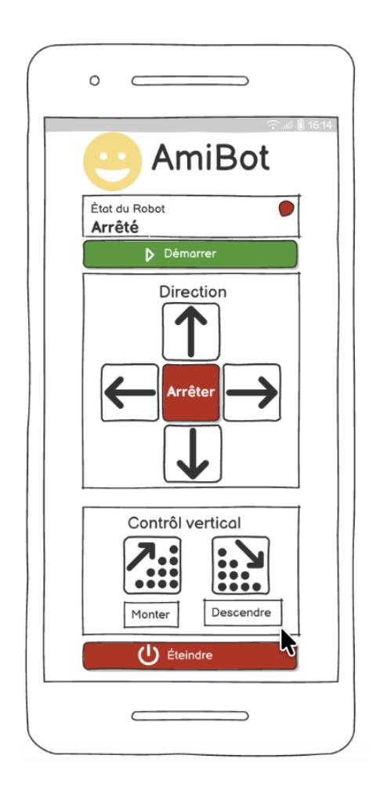

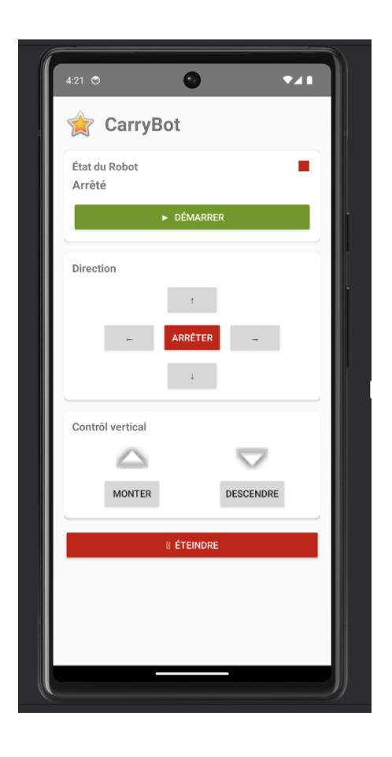

Figure 11 – interface application Android

Figure 10 – Prototype Figma

Figure 12 – Interface principale de l'application CarryBot

## 2.4 Logiciel

- Programme embarqué Raspberry Pi : développé en Python ou C++, assurant :
  - la gestion centrale de la motorisation,
  - la fusion des données issues des capteurs (ultrason, IMU, caméra),
  - la supervision de l'état du robot,
  - la communication avec l'application mobile.
- Application Android : développée sous Android Studio en Java, intégrant une interface à pictogrammes et des fonctionnalités d'accessibilité.
- Microcontrôleurs additionnels (si requis) : gestion dédiée des capteurs ou actionneurs via interfaces GPIO ou bus série, en communication avec la Raspberry Pi.

### 2.5 Acteurs

— Personnes à mobilité réduite (PMR) : utilisateurs finaux susceptibles d'utiliser CarryBot pour transporter de petits objets et réduire les déplacements physiques.

- Personnes âgées : utilisateurs pouvant bénéficier d'un soutien pour limiter les efforts, prévenir les chutes et faciliter la manipulation d'objets en intérieur.
- Patients en milieu hospitalier ou en centre de rééducation : utilisateurs potentiels ayant besoin d'une aide pour déplacer des objets personnels, consommables ou équipements légers.
- Aidants, infirmiers et personnels soignants : acteurs susceptibles d'utiliser CarryBot comme outil d'assistance pour diminuer la charge physique liée à la manutention de matériel léger.

À ce stade du projet, ces acteurs ne sont pas encore mis en relation directe avec le prototype. L'interaction effective avec CarryBot est actuellement limitée aux membres de l'équipe projet pour les activités de conception, de test et de validation interne.

### 2.6 Analyse des besoins

L'analyse des besoins repose sur une démarche centrée utilisateur visant à comprendre les attentes, contraintes et usages possibles des futurs bénéficiaires du robot CarryBot. Elle combine une approche qualitative (observations, entretiens exploratoires) et une approche quantitative (questionnaire de caractérisation des besoins fonctionnels et ergonomiques).

Les éléments identifiés mettent en évidence des exigences convergentes :

- Besoin d'assistance au transport d'objets du quotidien (médicaments, documents, bouteille d'eau, télécommande, petit matériel personnel).
- Attente d'un robot simple à piloter, notamment pour les utilisateurs présentant des limitations motrices ou cognitives : interface à pictogrammes, commandes limitées, retour visuel clair.
- Sécurité en environnement intérieur : arrêt immédiat, déplacement stable, absence de mouvements brusques.
- Contrôle manuel prioritaire : les utilisateurs souhaitent décider de la trajectoire et des actions du robot sans dépendre d'une autonomie complexe.
- Franchissement d'obstacles simples : seuils de portes, légères irrégularités, petites marches de quelques centimètres.
- Faible effort cognitif : la prise en main doit être immédiate.
- Fonctionnement silencieux et non intrusif : les usagers refusent tout robot perturbant l'environnement ou générant du stress.

Cette analyse confirme la pertinence d'un robot mobile, compact, stable, simple et compréhensible, conçu pour des environnements intérieurs restreints (chambre, couloir, salle de rééducation, domicile adapté).

## 2.7 Formulaire d'analyse des besoins — Tableau professionnel

| Catégorie                         | Questions / Éléments à renseigner                                                                                                                                                                                                                    |
|-----------------------------------|------------------------------------------------------------------------------------------------------------------------------------------------------------------------------------------------------------------------------------------------------|
| Profil utilisateur                | <ul> <li>Âge?</li> <li>Situation (domicile, EHPAD, hôpital):</li> <li>Handicap moteur ou cognitif (oui/non, précisions):</li> <li>Niveau d'autonomie:</li> </ul>                                                                                     |
| Usage prévu du robot              | <ul> <li>Besoin d'aide pour transporter des objets du quotidien? (oui/non)</li> <li>Objets à transporter principalement:</li> <li>Fréquence d'utilisation estimée:</li> <li>Lieux d'usage (chambre, salon, couloir, rééducation):</li> </ul>         |
| Accessibilité                     | <ul> <li>Préférence pour une interface avec pictogrammes?</li> <li>(oui/non)</li> <li>Difficultés avec smartphone ou tablette? (oui/non)</li> <li>Besoin d'un retour vocal? (oui/non)</li> <li>Besoin de commandes simplifiées? (oui/non)</li> </ul> |
| Sécurité                          | <ul> <li>— Importance d'un bouton d'arrêt d'urgence? (faible/moyenne/élevée)</li> <li>— Inquiétude face aux collisions ou mouvements brusques? (oui/non)</li> <li>— Sensibilité à l'équilibre des objets transportés? (oui/non)</li> </ul>           |
| Fonctionnalités attendues         | <ul> <li>Arrêt du robot via l'application? (oui/non)</li> <li>Capacité à franchir de petites marches? (oui/non)</li> <li>Palette stabilisée/ajustable? (oui/non)</li> <li>Retour sonore (feedback)? (oui/non)</li> </ul>                             |
| Observations complé- mentaires | Zone libre pour remarques, besoins spécifiques, contraintes particulières.                                                                                                                                                                           |

 ${\it TABLE~2-Formulaire~synth\'etique~d'analyse~des~besoins~utilisateurs --- Projet~CarryBot}$ 

#### 2.7.1 Personas — Public cible

Les personas suivants représentent des profils-types construits à partir des besoins identifiés. Ils servent de référence pour orienter la conception fonctionnelle et ergonomique de CarryBot.

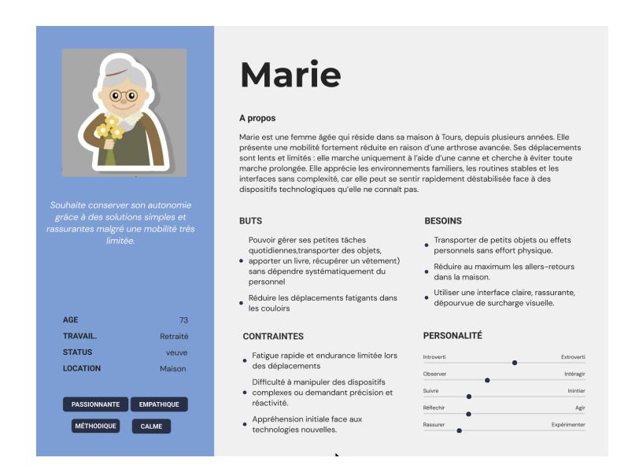

Figure 13 – Persona 1 : Marie, 75 ans, retraitée

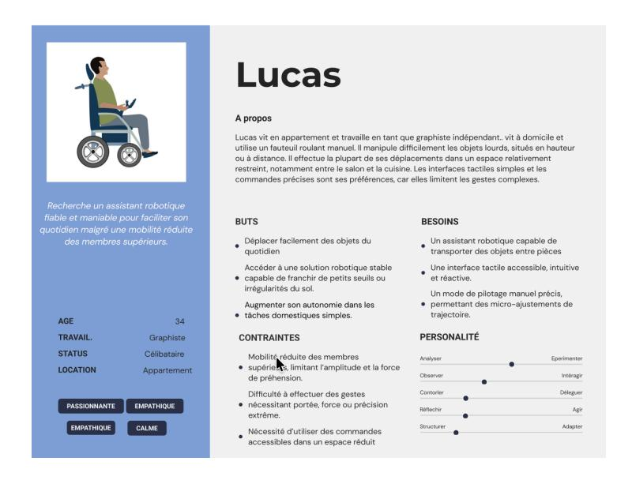

Figure 14 – Persona 2 : Lucas, 30 ans, à mobilité réduite

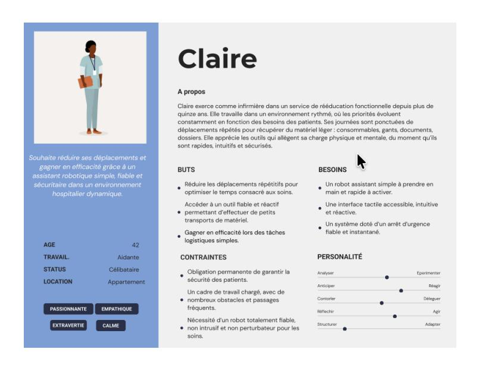

Figure 15 – Persona 3 : Claire, 45 ans, aide-soignante

#### 2.7.2 Exigences fonctionnelles

| Id  | Exigence                              | Priorité | Commentaire                     |
|-----|---------------------------------------|----------|---------------------------------|
| EF1 | Suivi autonome d'un tracé au sol      | H        | Pilotage via capteurs ul        |
|     |                                       |          | trasons et caméra.              |
| EF2 | Commande manuelle via application     | H        | Interface à pictogrammes        |
|     | Android                               |          | simplifiée.                     |
| EF3 | Arrêt d'urgence physique              | H        | Interruption immédiate       |
|     |                                       |          | des moteurs.                    |
| EF4 | Arrêt logiciel sécurisé               | H        | Arrêt critique déclenché  |
|     |                                       |          | depuis l'application.           |
| EF5 | Franchissement de petites marches     | M        | Système de roues Tri   |
|     |                                       |          | Star.                           |
| EF6 | Transport d'objets légers sur palette | H        | Capacité de charge jus |
|     | motorisée                             |          | qu'à 2 kg.                      |
| EF7 | Élévation de la palette motorisée     | M        | Transport d'objets lé     |
|     |                                       |          | gers.                           |

#### 2.7.3 Exigences qualité (non fonctionnelles)

| Id  | Critère de qualité       | Priorité | Commentaire                |
|-----|--------------------------|----------|----------------------------|
| EQ1 | Sécurisation du système  | H        | Gestion fiable des arrêts  |
|     |                          |          | d'urgence.                 |
| EQ2 | Ergonomie de l'interface | H        | Accessibilité UI,       |
|     |                          |          | contraste, pictogrammes.   |
| EQ3 | Robustesse mécanique     | M        | Résistance des compo |
|     |                          |          | sants imprimés 3D.         |
| EQ4 | Autonomie minimale       | M        | 30 minutes de fonction     |
|     |                          |          | nement continu.            |

#### 2.7.4 Exigences légales et réglementaires

| Id  | Exigence                | Priorité | Commentaire              |
|-----|-------------------------|----------|--------------------------|
| EL1 | Conformité électrique   | H        | Respect des normes |
|     |                         |          | basse tension.           |
| EL2 | Accessibilité numérique | H        | Référentiel RGAA appli   |
|     |                         |          | cable à l'application mo |
|     |                         |          | bile.                    |
| EL3 | Sécurité d'usage        | M        | Gestion des risques pour |
|     |                         |          | utilisateurs fragiles.   |

# 3 Solutions et orientations

### 3.1 Solutions techniques retenues

Les principales orientations techniques du projet CarryBot sont les suivantes :

- Pilotage manuel via une application Android : l'utilisateur contrôle le robot à l'aide d'une interface à pictogrammes conçue dans Android Studio (Java), intégrant des fonctionnalités d'accessibilité.
- Suivi de ligne pour le déplacement semi-autonome : les capteurs infrarouges permettent au robot de suivre un tracé au sol de manière stable et prédictible.
- Franchissement de petites marches : le système de roues Tri-Star offre la capacité de franchir de faibles dénivelés (marches, seuils), en conservant la stabilité du robot.
- Palette stabilisatrice assistée par vérin : la palette n'est pas destinée à soulever des charges, mais à stabiliser les objets transportés lors du franchissement des marches. Le vérin linéaire ajuste la position de la palette afin :
  - de maintenir l'objet en place,
  - d'éviter les basculements ou glissements,
  - d'assurer une stabilité optimale lorsque le robot franchit une marche.

Cette fonction garantit la sécurité du transport sans nécessiter un mécanisme de levage complexe.

- Sécurisation des déplacements : un bouton STOP physique, complété par un arrêt logiciel, assure une interruption immédiate des moteurs en cas de risque.
- Retour vocal côté application : l'application peut fournir des messages vocaux pour améliorer l'accessibilité des utilisateurs ayant des besoins spécifiques.

### 3.2 Contraintes et orientations de conception

- Contraintes physiques : masse totale du robot inférieure à 3 kg.
- Contraintes d'autonomie : au moins 30 minutes de fonctionnement continu.
- Contraintes de sécurité : mécanismes d'arrêt d'urgence adaptés à un usage hospitalier et PMR.
- Contraintes logicielles : navigation limitée au suivi de ligne pour simplifier l'architecture.

### 3.3 Plan de réalisation

| Semaines | Tâches                                 |
|----------|----------------------------------------|
| 1–2      | prototypage du CarryBot                |
| 3–4      | Conception 3D Tri-Star                 |
| 4–5      | Etablissement de l'analyse des besoins |
| 5–6      | Développement application Android      |
| 7        | Câblage capteurs                       |
| 8        | Intégration moteurs                    |
| 9        | Programmation agent robotique          |
| 10       | Application Android                    |
| 11       | Intégration finale et tests            |

### 3.4 Perspectives

- Suivi de personne
- Cartographie LIDAR
- Version plus grande

# 4 Validation et tests utilisateurs

### 4.1 Critères de validation — Tests techniques et fonctionnels

L'évaluation du prototype du carrybot repose sur plusieurs tests précis :

L'autonomie : temps avant que le carrybot n'ai besoin d'une nouvelle batterie, mesuré en minutes. Pour le prototype actuel, le premier objectif sera 5 minutes. L'objectif final sera 30 minutes.

La vitesse de déplacement horizontal : mesurée en mètres par seconde. La difficulté surtout tiendra dans la capacité à tourner de façon fluide.

La capacité de déplacement vertical : nombre de marches que le carrybot est capable de monter. Pour l'instant, le prototype est capable de monter des marches d'environ 4 centimètres, et notre objectif sera qu'il parvienne à en monter au moins trois à la suite. Notre objectif final sera qu'il en monte dix.

Capacité de charge : on estime actuellement que le carrybot sera capable de transporter jusqu'à 2kg.

L'efficacité du rééquilibrage : capacité du dispositif à repérer que le plateau n'est plus droit (par le niveau) puis à envoyer l'électricité au vérin pour qu'il le rééquilibre rapidement à partir de deux mesures : — en secondes, notre premier objectif est que le dispositif parvienne à la stabilité au bout de trois secondes, et notre objectif final en moins d'une seconde ; — par le maintien des objets dans la boite, qui ne doivent ni tomber ni être brisés.

Capacité de reconnaissance de la caméra : le carrybot doit être capable de suivre des bandes réfléchissantes au sol lors du déplacement horizontal.

Contrôle : efficacité de contrôle de carrybot par l'application.

Ergonomie de l'application : évaluation ergonomique par les critères de Bastien et Scapin, évaluation de l'accessibilité par le RGAA.

### 4.2 Scénario UX 1 — Personne à Mobilité Réduite (PMR)

Lucas, 30 ans, vit dans une maison à deux étages parfaitement adaptée à son fauteuil roulant. Son environnement a été ajusté pour lui permettre un maximum d'autonomie, mais certains obstacles restent difficiles à franchir seul, et en particulier l'escalier central de la maison. Pour cette raison, il utilise depuis quelques mois Carrybot, un robot mobile conçu pour transporter des objets essentiels dans un compartiment intégré. Contrairement à d'autres modèles, Carrybot ne possède pas de bras motorisé : il ne va donc pas chercher les objets lui-même. À la place, Lucas garde en permanence certaines affaires importante dans la boite du robot, notamment ses médicaments quotidiens. L'objectif de Carrybot n'est pas de saisir des objets, mais de les amener à l'utilisateur efficacement et en toute sécurité.

Ce matin, Lucas est installé dans sa chambre, au premier étage, en train de répondre à des mails professionnels. Entre deux messages, il ressent un léger rappel physique qui lui signale qu'il est l'heure de prendre son traitement. Son pilulier ne se trouve pas à portée de main : il l'a laissé volontairement dans le compartiment du robot la veille, pour éviter d'avoir à gérer un transport risqué dans les escaliers. Descendre en fauteuil pour aller chercher la boîte serait possible mais fastidieux, surtout lorsqu'il est concentré ou lorsqu'il souhaite gagner du temps. Carrybot a été pensé précisément pour ces situations.

Il attrape son smartphone posé sur sa table et ouvre l'application Carrybot. L'interface affiche deux modes : l'un manuel, l'autre automatique. Lucas utilise la commande automatique. Carrybot, en suivant des bandes réfléchissantes au sol, se déplace seul pour amener ses médicaments à Lucas.

Arrivé au pied de l'escalier, Carrybot active son module de montée. C'est la partie la plus critique du trajet : s'il n'est pas suffisamment stable, il risque d'endommager les médicaments ou même de tomber. L'application affiche alors un message discret : "Montée en cours – veuillez patienter." Lucas observe attentivement les informations à l'écran. Le robot gravit les marches une à une, lentement mais sûrement. L'interface indique chaque progression avec une icône qui change de couleur au fur et à mesure. Aucun signe d'erreur n'apparaît, ce qui signifie que les capteurs d'équilibre du robot fonctionnent correctement.

Quelques instants plus tard, une vibration douce sur son téléphone signale : "Carrybot – étage 1 atteint." Le robot termine son déplacement jusqu'à la porte ouverte de la chambre. Lucas entend le léger bruit de ses roues sur le parquet du couloir avant de le voir apparaître.

Sur l'écran, un dernier message s'affiche : "Carrybot est arrivé." Lucas s'avance avec son fauteuil et ouvre manuellement le compartiment du robot. À l'intérieur, la boîte de médicaments est intacte. Il la prend, referme le compartiment et appuie sur le bouton "Retour à la base". Carrybot exécute l'ordre immédiatement et commence son trajet vers le rez-de-chaussée.

Lucas referme l'application en souriant. L'expérience utilisateur est simple, fiable et bien adaptée à ses besoins : pas de manipulations complexes, pas d'interfaces confuses. L'ensemble garantit une autonomie quotidienne qu'il apprécie pleinement.

#### Questionnaire utilisateur — Scénario Lucas

#### 1- Compréhension & ergonomie de l'application

- L'écran d'accueil vous a-t-il permis de comprendre rapidement comment activer Carrybot ?
- Les icônes vous paraissent-elles claires et compréhensibles ?

- Avez-vous trouvé la commande "mode automatique" facile à repérer et à comprendre ?
- Les étapes affichées lors du déplacement du robot (départ, montée, arrivée) étaientelles suffisamment explicites ?
- Les messages affichés en cas d'actions importantes (ex. montée des escaliers) étaient-ils rassurants et faciles à interpréter ?
- Avez-vous trouvé qu'il y avait des fonctionnalités de l'application difficiles d'accès ?

### 2- Capacité du robot à exécuter correctement les actions

- Carrybot a-t-il répondu rapidement et précisément aux commandes envoyées depuis l'application ?
- Le déplacement du robot vous semble-t-il fluide et adapté à un usage quotidien ?
- Avez-vous constaté une cohérence entre ce qui est affiché dans l'application et le comportement réel du robot ?
- La montée des escaliers vous semble-t-elle suffisamment stable et sécurisée pour transporter des objets sensibles (comme des médicaments) ?
- Le robot atteint-il votre position sans erreur ou besoin de correction ?
- Globalement, considérez-vous que Carrybot est fiable pour apporter des objets essentiels sans intervention humaine ?

### 4.3 Scénario UX 2 — Aidante professionnelle (infirmière)

Claire travaille comme infirmière dans une clinique. Chaque matin, elle commence à distribuer les médicaments de son étage auprès d'une dizaine de patients. Habituellement, elle transporte les traitements dans un chariot, mais cette méthode n'est pas idéale : fatigue physique, perte de temps dans les déplacements, nécessité de rester attentive à l'organisation des piluliers, et surtout fatigue accumulée au fil des jours. Depuis quelques semaines, le centre expérimente l'usage de Carrybot.

Ce matin, Claire commence sa tournée à 7h30. Elle ouvre l'application Carrybot sur sa tablette professionnelle. Dès l'écran d'accueil, la distinction entre les différents modes est très visible : Mode manuel à gauche, Mode automatique à droite. Claire sélectionne d'abord le mode manuel. À l'aide des icones, Claire dirige Carrybot jusqu'à l'infirmerie, où une autre aide-soignante installe des médicaments dans la boite. Puis, Claire sélectionne le mode automatique. L'application affiche alors un message introductif : « Sélectionnez les chambres où Carrybot devra s'arrêter. »

Claire coche les chambres 102, 104, 108 et 110, celles des patients qui doivent recevoir chacun les mêmes médicaments. Chaque sélection se transforme en icône bleue très lisible. Une fois la liste finalisée, un bouton apparaît : « Démarrer le parcours ».

Claire appuie dessus. Sur l'application, un indicateur apparait : « Mode automatique actif ». Claire n'a pas besoin de marcher à côté de lui. Elle peut préparer ses dossiers tout en gardant un œil sur l'écran. Le déplacement du robot est fluide : il suit parfaitement la bande au sol, ajustant légèrement sa trajectoire quand nécessaire. L'application montre ces ajustements dans une sorte de "chemin lumineux", ce qui permet à Claire de visualiser la précision de la navigation.

Arrivé devant la chambre 102, le robot ralentit puis s'arrête. L'application affiche immédiatement : « Arrêt prévu – chambre 102. Appuyez sur "Continuer" une fois la distribution terminée. »

Claire entre dans la chambre, récupère les médicaments dans le compartiment sécurisé du robot, les distribue au patient, puis ressort. Elle appuie sur le bouton « Continuer » de la tablette. Le robot repart aussitôt.

Sur son trajet vers la chambre 104, un obstacle imprévu apparaît : un chariot de ménage stationné trop près de la bande réfléchissante. Les capteurs de Carrybot détectent l'obstacle et l'application affiche : « Obstacle détecté – contournement en cours »

Le robot s'écarte légèrement, contourne l'objet, puis retrouve la bande réfléchissante sans difficulté. Claire jette un coup d'œil rapide à son écran : elle apprécie cette transparence du système qui lui évite d'avoir à s'inquiéter.

Arrivé en chambre 104, même procédure : arrêt automatique, message clair, possibilité de reprendre le parcours à tout moment. Claire gagne un temps considérable. Elle apprécie particulièrement le fait que la tablette ne surcharge pas l'écran d'informations inutiles : elle ne voit que ce dont elle a réellement besoin : les arrêts, l'état du robot et les alertes pertinentes.

Le même processus se déroule ensuite pour les chambres 108 et 110. À la fin du parcours, Carrybot retourne automatiquement à son point de départ. L'application affiche alors : « Parcours terminé – Carrybot en mode attente. »

Claire referme l'application en souriant. Ce mode automatique simplifie énormément sa tournée : plus besoin de pousser un chariot, pas de risque de renverser des médicaments, et surtout une sensation de sécurité grâce à l'interface claire et au comportement fiable du robot.

### Questionnaire — Scénario Claire

#### 1- Compréhension & ergonomie du mode automatique

- La distinction entre les modes manuel et automatique vous semble-t-elle claire ?
- Avez-vous compris facilement comment sélectionner les chambres où Carrybot devait s'arrêter ?
- Avez-vous pu naviguer facilement avec le mode manuel ?
- Les icônes (arrêts programmés, parcours, position du robot) étaient-elles compréhensibles ?
- Les messages lors des arrêts (ex. « Appuyez sur Continuer ») vous paraissent-ils adaptés et explicites ?
- Avez-vous trouvé l'ensemble de l'interface intuitive et agréable à utiliser ?

### 2- Capacité du robot à réaliser les actions demandées

- Carrybot a-t-il correctement suivi la bande réfléchissante au sol sans déviations dangereuses ?
- Les arrêts programmés devant les chambres étaient-ils précis et fiables ?
- Le robot redémarre-t-il correctement après chaque arrêt ?
- Avez-vous observé un comportement rassurant face aux obstacles (arrêt, contournement, information dans l'application) ?
- Les mouvements du robot vous semblent-ils adaptés à une utilisation dans un environnement médical (stabilité, discrétion, fluidité) ?
- Globalement, considérez-vous que Carrybot est un outil fiable pour aider à la distribution des médicaments en mode automatique ?

# Bibliographie

# Références

- [1] Hospital News, "How ROSA the Robot Will Help Isolated Seniors and Support Aging in Place", 2022. [https://hospitalnews.com/how-rosa-the-robot-will-help](https://hospitalnews.com/how-rosa-the-robot-will-help-isolated-seniors-and-support-aging-in-place/)[isolated-seniors-and-support-aging-in-place/](https://hospitalnews.com/how-rosa-the-robot-will-help-isolated-seniors-and-support-aging-in-place/)
- [2] Labrador Systems, "Labrador Retriever", 2022. <https://labradorsystems.com/>
- [3] Borobo, "Help-E", 2022. <https://borobo.fr/>